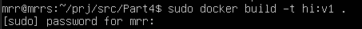
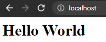

# Simple Docker

После [Части 2](#part-2-операции-с-контейнером) скриншоты используются в основном как подсказка по командам.

## Contents

1. [Готовый докер](#part-1-готовый-докер)
2. [Операции с контейнером](#part-2-операции-с-контейнером)
3. [Мини веб-сервер](#part-3-мини-веб-сервер)
4. [Свой докер](#part-4-свой-докер)
5. [Dockle](#part-5-dockle)
6. [Базовый Docker Compose](#part-6-базовый-docker-compose)

## Part 1. Готовый докер

##### Берем официальный докер образ при помощи команды `docker pull nginx`

##### Проверим наличие докер образа через `docker images`

##### Запустим докер образ командой `docker run -d nginx`

##### Проверим, что образ запустился через `docker ps`

##### Посмотрим информацию о контейнере через `docker inspect [container_id|container_name]`

##### По выводу команды определить и поместить в отчёт размер контейнера, список замапленных портов и ip контейнера:

##### Размер контейнера (параметры команды из [документации](https://docs.docker.com/engine/reference/commandline/inspect/) docker)

##### Список замапленных портов

Первой командой ищем нужную нам строку вывода ("Ports"), дальше выведем 10 строк после этой строки. Нужная нам строка с ответом - 183. Делаем именно так, чтобы убедиться что порт единственный.

##### IP контейнера (параметры команды из [документации](https://docs.docker.com/engine/reference/commandline/inspect/) docker)

##### Остановить докер образ через `docker stop [container_id|container_name]`

##### Проверить, что образ остановился через `docker ps`

##### Запустить докер с портами 80 и 443 в контейнере, замапленными на такие же порты на локальной машине, через команду *run*

##### Проверить, что в браузере по адресу *localhost:80* доступна стартовая страница **nginx**

##### Перезапустить докер контейнер через `docker restart [container_id|container_name]`
##### Проверить любым способом, что контейнер запустился

## Part 2. Операции с контейнером

##### Прочитаем конфигурационный файл *nginx.conf* внутри докер контейнера через команду `docker exec [container_id] cat /etc/nginx/nginx.conf`

##### Создаем на локальной машине файл *nginx.conf*

Далее копируем содержимое изначального конфига

##### Настроить в нем по пути */status* отдачу страницы статуса сервера **nginx**. Итоговый файл конфига:

##### Скопировать созданный файл *nginx.conf* внутрь докер образа через команду `docker cp`  и перезапустить **nginx** внутри докер образа через команду *exec*

##### Проверить, что по адресу *localhost:80/status* отдается страничка со статусом сервера **nginx**

##### Экспортировать контейнер в файл *container.tar* через команду *export*

Используем флаг -o, чтобы указать название файла в который мы хотим совершить экспорт.

##### Остановить контейнер

##### Удалить образ через `docker rmi [image_id|repository]`, не удаляя перед этим контейнеры

Просто удалить не вышло - удалили насильно.

##### Удалить остановленный контейнер

##### Импортировать контейнер обратно через команду *import*

Флаг -c позволяет применить инструкции Dockerfile к созданному образу.

##### Запустить импортированный контейнер и проверить, что по адресу *localhost:80/status* отдается страничка со статусом сервера **nginx**

## Part 3. Мини веб-сервер

##### Написать мини сервер на **C** и **FastCgi**, который будет возвращать простейшую страничку с надписью `Hello World!`
##### Запустить написанный мини сервер через *spawn-fcgi* на порту 8080
##### Написать свой *nginx.conf*, который будет проксировать все запросы с 81 порта на *127.0.0.1:8080*
##### Проверить, что в браузере по *localhost:81* отдается написанная вами страничка
##### Положить файл *nginx.conf* по пути *./nginx/nginx.conf* (это понадобится позже)

#### Запуск и выключение сервера

## Part 4. Свой докер

##### Собрать написанный докер образ через `docker build` при этом указав имя и тег

##### Проверить через `docker images`, что все собралось корректно

##### Запустить собранный докер образ с маппингом 81 порта на 80 на локальной машине и маппингом папки *./nginx* внутрь контейнера по адресу, где лежат конфигурационные файлы **nginx**'а (см. [Часть 2](#part-2-операции-с-контейнером))

##### Проверить, что по localhost:80 доступна страничка написанного мини сервера

##### Дописать в *./nginx/nginx.conf* проксирование странички */status*, по которой надо отдавать статус сервера **nginx**

##### Перезапустить докер образ

*Если всё сделано верно, то, после сохранения файла и перезапуска контейнера, конфигурационный файл внутри докер образа должен обновиться самостоятельно без лишних действий*

##### Проверить, что теперь по *localhost:80/status* отдается страничка со статусом **nginx**

## Part 5. **Dockle**

##### Просканировать образ из предыдущего задания через `dockle [image_id|repository]`
##### Исправить образ так, чтобы при проверке через **dockle** не было ошибок и предупреждений

#### Вывод после исправления

## Part 6. Базовый **Docker Compose**

##### Написать файл *docker-compose.yml*, с помощью которого:
##### 1) Поднять докер контейнер из [Части 5](#part-5-инструмент-dockle) _(он должен работать в локальной сети, т.е. не нужно использовать инструкцию **EXPOSE** и мапить порты на локальную машину)_
##### 2) Поднять докер контейнер с **nginx**, который будет проксировать все запросы с 8080 порта на 81 порт первого контейнера
##### Замапить 8080 порт второго контейнера на 80 порт локальной машины

##### Остановить все запущенные контейнеры
##### Собрать и запустить проект с помощью команд `docker-compose build` и `docker-compose up`

##### Проверить, что в браузере по *localhost:80* отдается написанная вами страничка, как и ранее - после первой команды показывается, после второй - нет.
